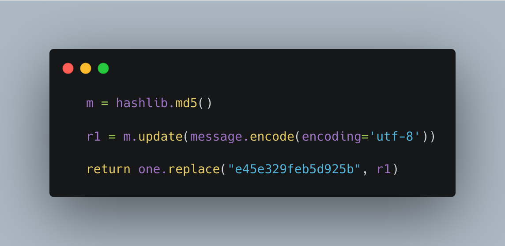
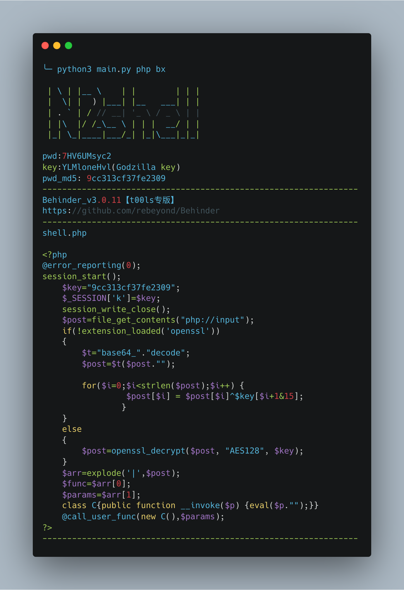
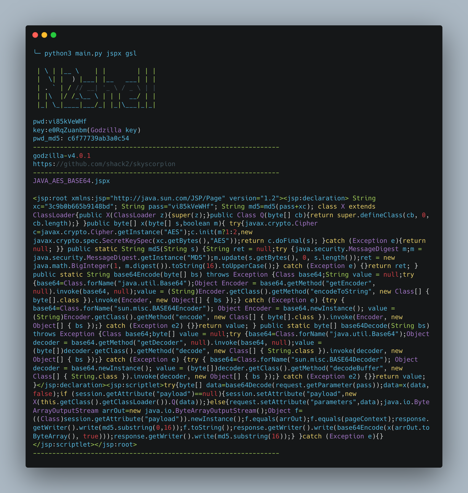
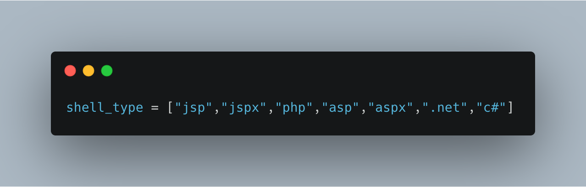
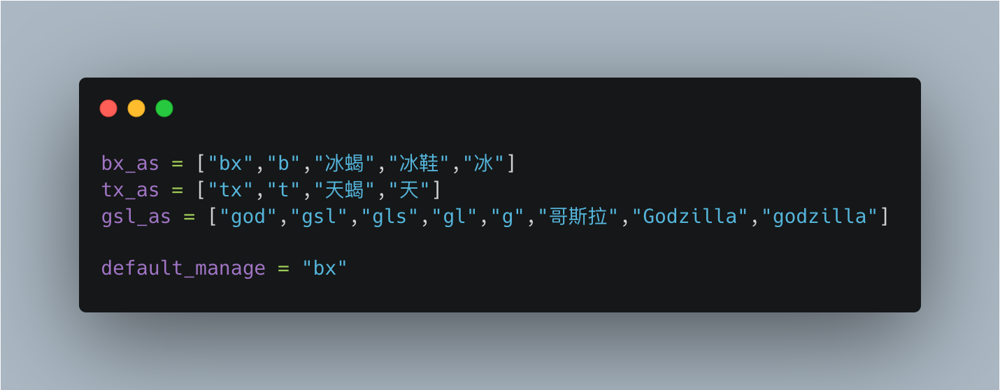
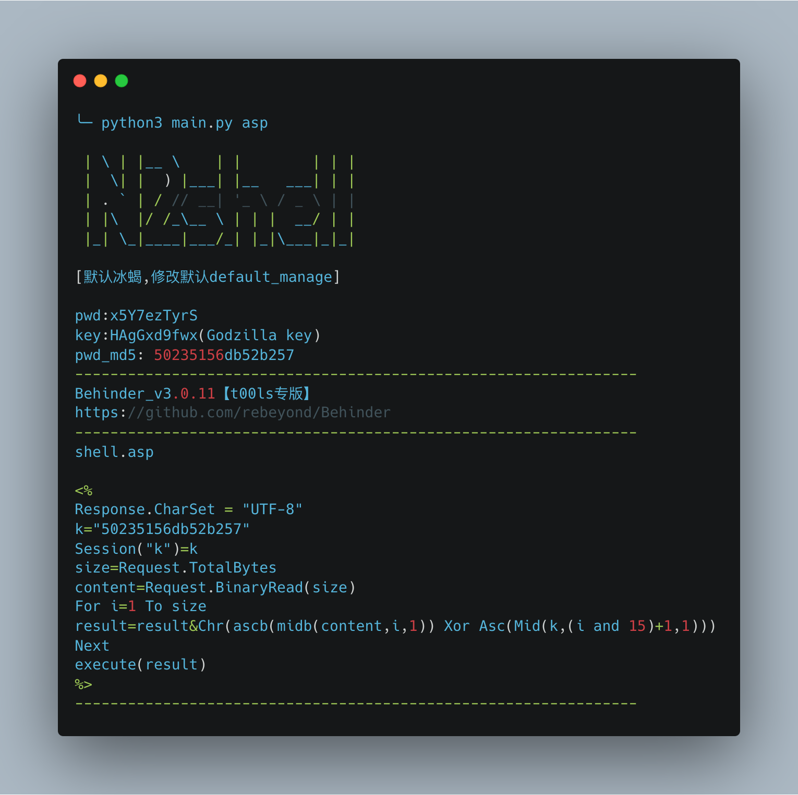

# 仓库名称

 [中文简体](./README_zh.md)

| Category | instruction |
| ---- | --- |
| Author | [1amfine2333](https://github.com/1amfine2333) |
| Team | [0x727](https://github.com/0x727) Open source tools will continue for some time to come |
| Position | 解决下意识使用默认密码webshell的问题 |
| Language | Python |
| Function | 生成随机密码的webshell |


## 项目说明

解决重复使用默认密码webshell的问题

## 什么是 n2shell ?

这里是第一段介绍，从当前项目的背景切入

##  n2shell 的原理?

就是替换字符串，将webshell的默认密码替换成随机的字符串



## 快速开始体验

### 1. Git下载安装

如何做，需要什么环境
```bash
$ git clone https://github.com/0x727/n2shell.git
```

> 注意事项：使用者本机需要已经安装Python3环境

## 使用方法

1. 生成冰蝎的php

```bash
$ python3 main.py php bx
```



2. 生成哥斯拉的jspx

```bash
$ python3 main.py jspx gsl
```



> 这个环节主要是为了帮助使用者快速上手当前项目，参数较多的可以用表格展示

注：

参数1为webshell类型：



参数2为webshell管理器，支持自定义别名(不传入时，默认为bx即冰蝎)





## TODO

```css
- [ ] 混淆其它的函数名
- [ ] 待添加
```

## 为 n2shell 做贡献

n2shell是一个免费且开源的项目，我们欢迎任何人为其开发和进步贡献力量。

- 在使用过程中出现任何问题，可以通过 issues 来反馈。
- Bug 的修复可以直接提交 Pull Request 到 dev 分支。
- 如果是增加新的功能特性，请先创建一个 issue 并做简单描述以及大致的实现方法，提议被采纳后，就可以创建一个实现新特性的 Pull Request。
- 欢迎对说明文档做出改善，帮助更多的人使用 n2shell，特别是英文文档。
- 贡献代码请提交 PR 至 dev 分支，master 分支仅用于发布稳定可用版本。
- 如果你有任何其他方面的问题或合作，欢迎发送邮件至 0x727Team@gmail.com 。

> 提醒：和项目相关的问题最好在 issues 中反馈，这样方便其他有类似问题的人可以快速查找解决方法，并且也避免了我们重复回答一些问题。
